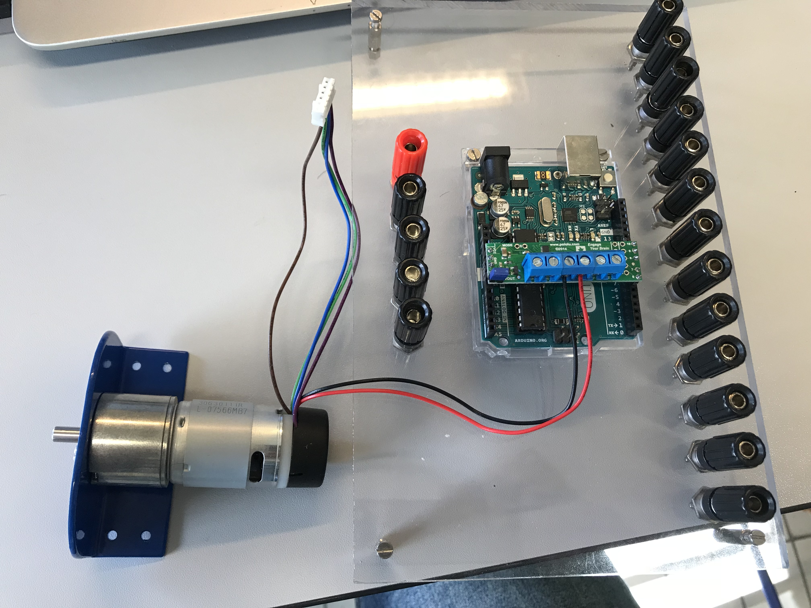
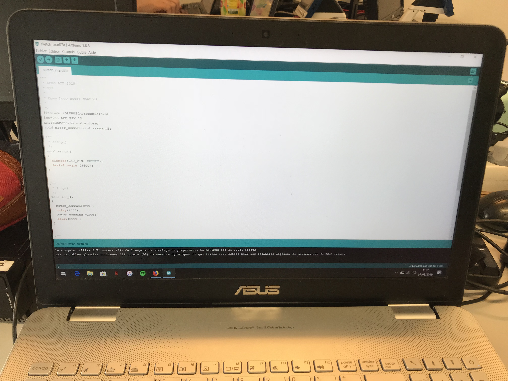
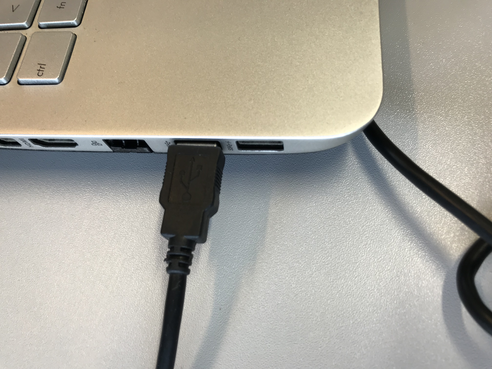

# LPro AIT 2019 - TP1 - Test procedure : motor with arduino

- Names
    - Loris ARNAUD
    - Augustin GARES

The 7th of March of 2019

## Purpose of the document

- This document is a procedure of test to verify that the motor is functionnal.

## 1. Hardware list

1. The result of the *assembly2_motor_and_arduino* procedure X1

    

2. Laptop X1

    
    
3. USB câble X1

    

## 2. Test procedure : motor with arduino

### 1. Wire the laptop to the arduino with USB
- Wire the laptop to the arduino with the USB cable.

### 2. Arduino program verification
- Verify that the arduino UNO has been program with the *motor_control_open_loop* software. If it's not, download the software that is in the folder */sources/motor_control_open_loop*.

### 3. Open the Arduino software
- Open the arduino software. In *Tool* select the arduino card and select the right COM port.

### 4. Verify the following informations
- Verify that :
    - The motor turns clockwise for 2s then turns anticlockwise for 2s.
    - When the motor turns clockwise, the L LED of the arduino is ON and is OFF when the motor turns anticlockwise.

### Results

|Action|Passed|Failed|Annotations|
|-|-|-|-|
|The motor turns clockwise for 2s||||
|After, the motor turns anticlockwise for 2s||||
|The LED is ON when the motor turns clockwise||||
|The LED is OFF when the motor turns anticlockwise||||

 