<!--# Correction
* Put **/procedures** and **/pictures** folders in **/docs**.
* Exact same remarks as the other procedure.... please read them!-->

# LPro AIT 2019 - TP1 - Assembly procedure : motor to the arduino

- Names
    - Loris ARNAUD
    - Augustin GARES

The 7th of March of 2019

## Purpose of the document

- This document is a procedure that have to be used to assemble the motor and its support to an arduino UNO to control the motor.

## 1. Hardware list

- EMG30 motor with blue support assembly X1

    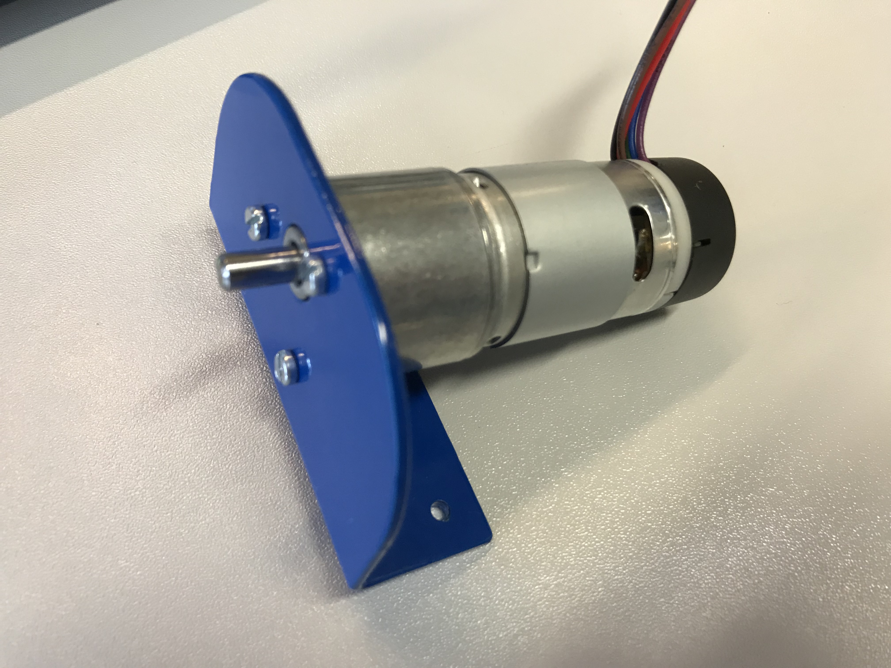

- Arduino Uno X1

    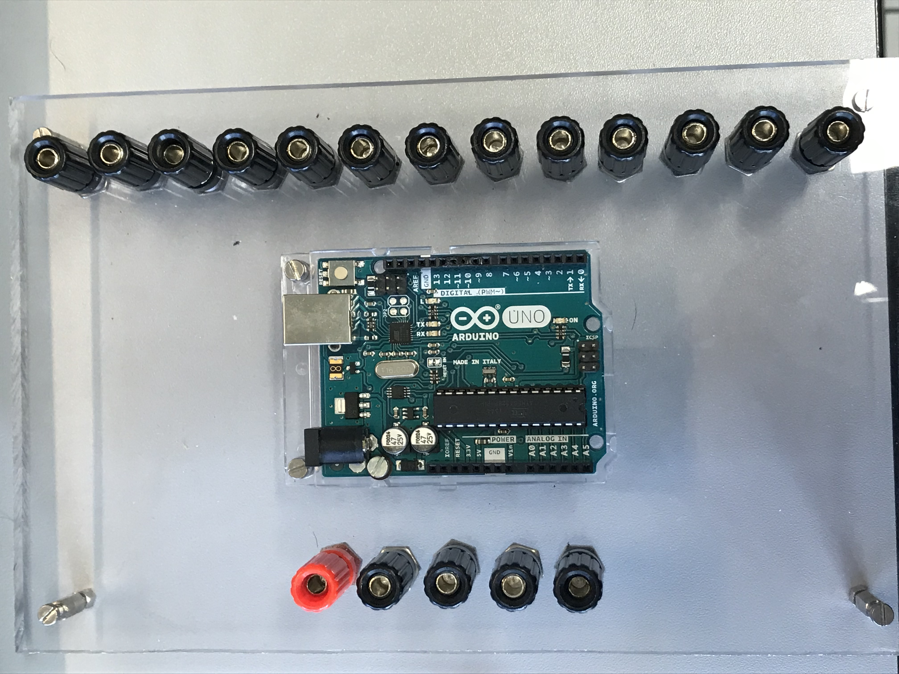

- Arduino shield - Pololu DRV8835 Dual Motor Driver with jumper X1

    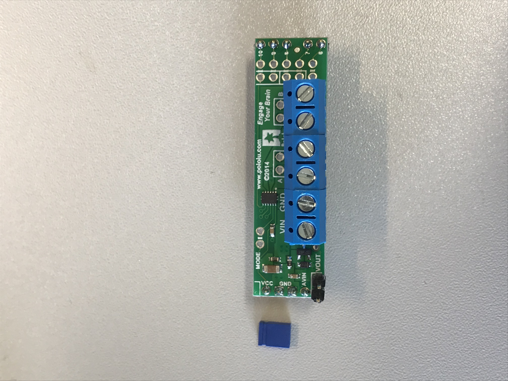

- Laptop X1

    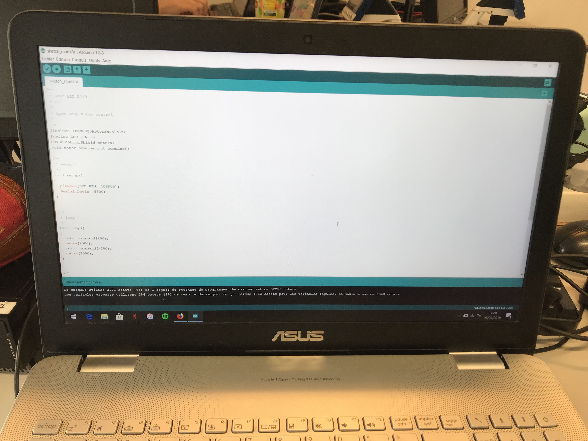
    
- USB câble X1

    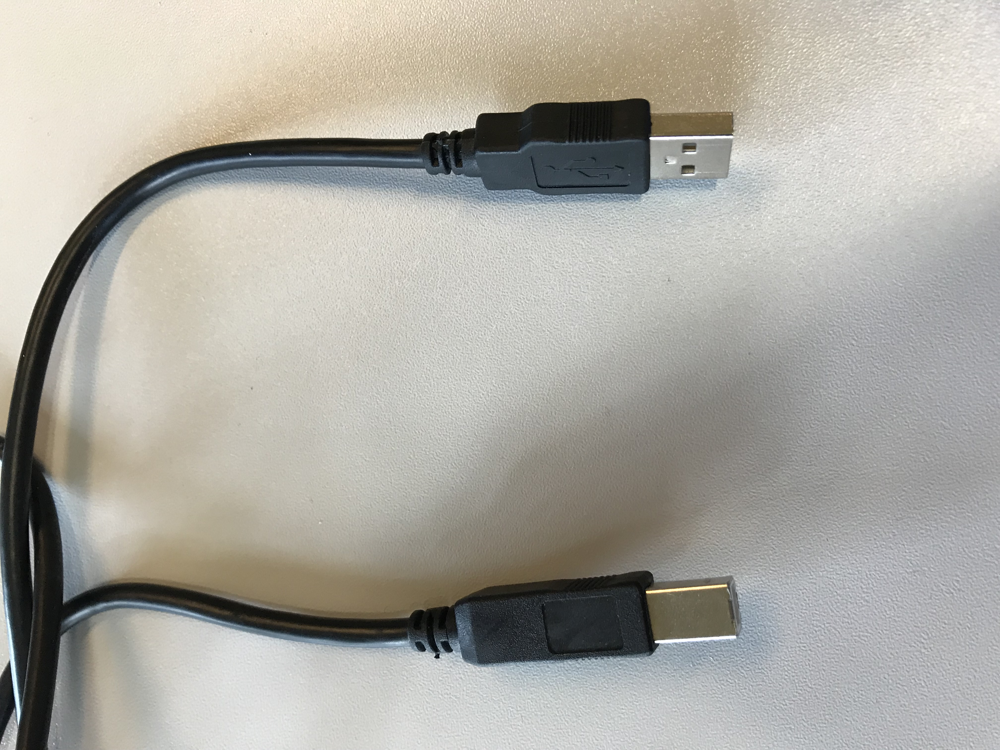

## 2. Tools

- Flathead screwdriver X1

    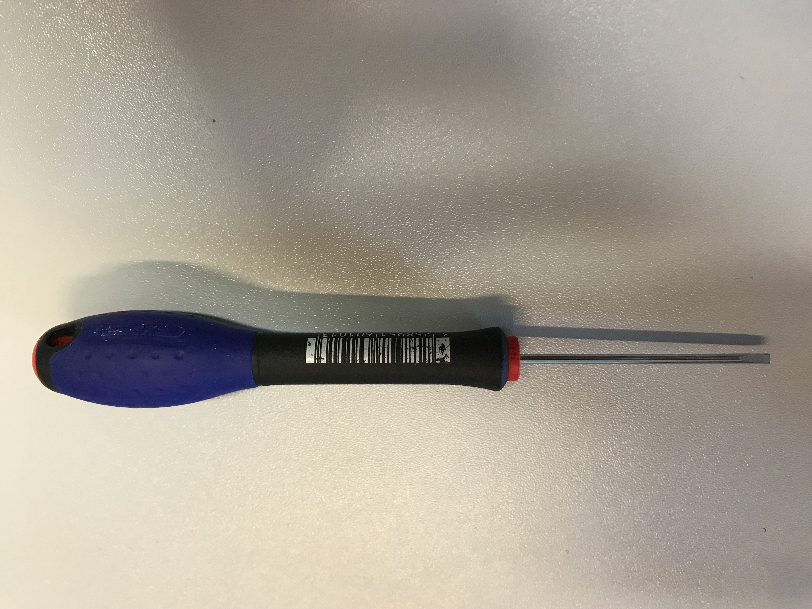

## 3. Assembly procedure : motor to the arduino

### 1. Download the program
- Download the arduino program motor_control_open_loop on the laptop. This program is in the folder */sources/motor_control_open_loop*.

### 2. Download the librarie
- Download the DRV8835MotorShield librarie into the arduino IDE. [How to install the library](https://github.com/pololu/drv8835-motor-shield).

### 3. Laptop-arduino wiring
- Wire the laptop to the arduino with the USB cable.

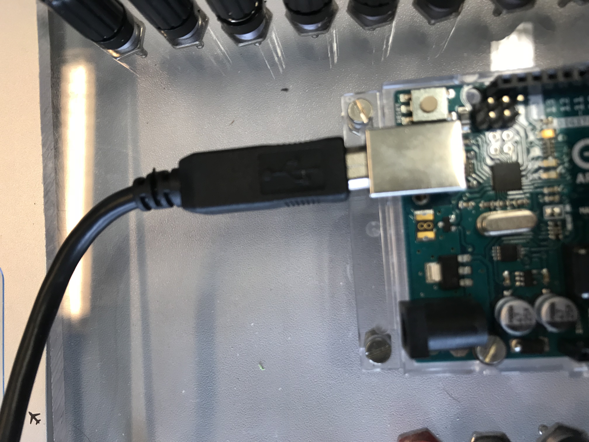

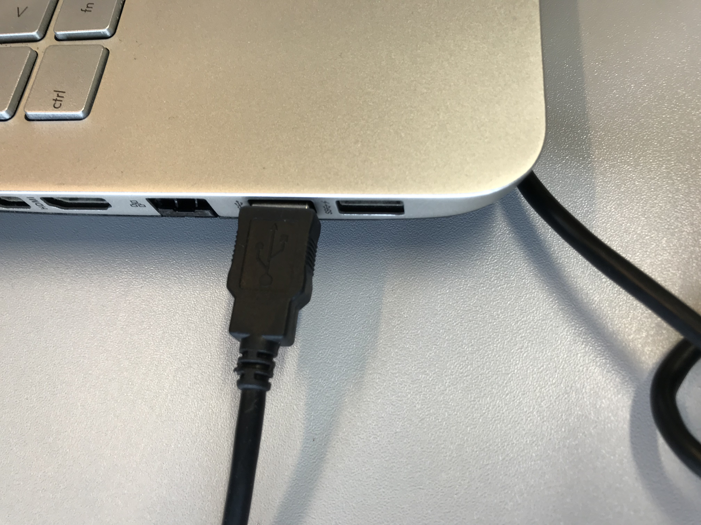

### 4. LED blinking
- Download the *motor_control_open_loop* software on the arduino UNO and verify if the LED blinks every 2 secondes on the arduino. After, unwire the USB cable from the arduino and the laptop.

### 5. Jumper wiring
- Put the jumper on the motor shield on the VOUT pin, like on the picture.

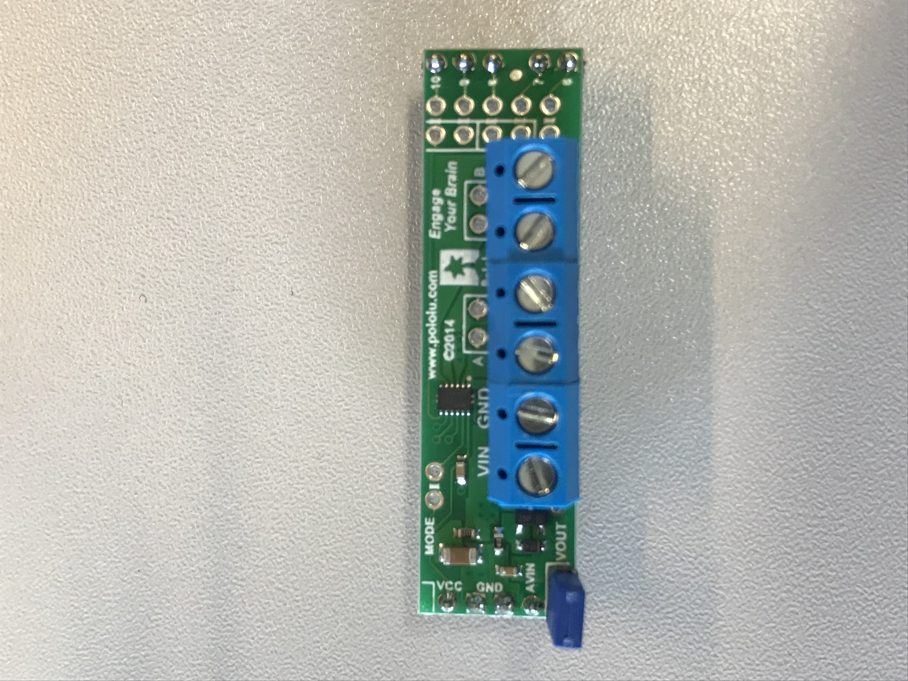

### 6. Pin the shield
- Pin the arduino shield on the arduino. The Vcc pin of the shield have to be on the 5V pin of the arduino. Verify that pins of the shield are on rights pins of the arduino.

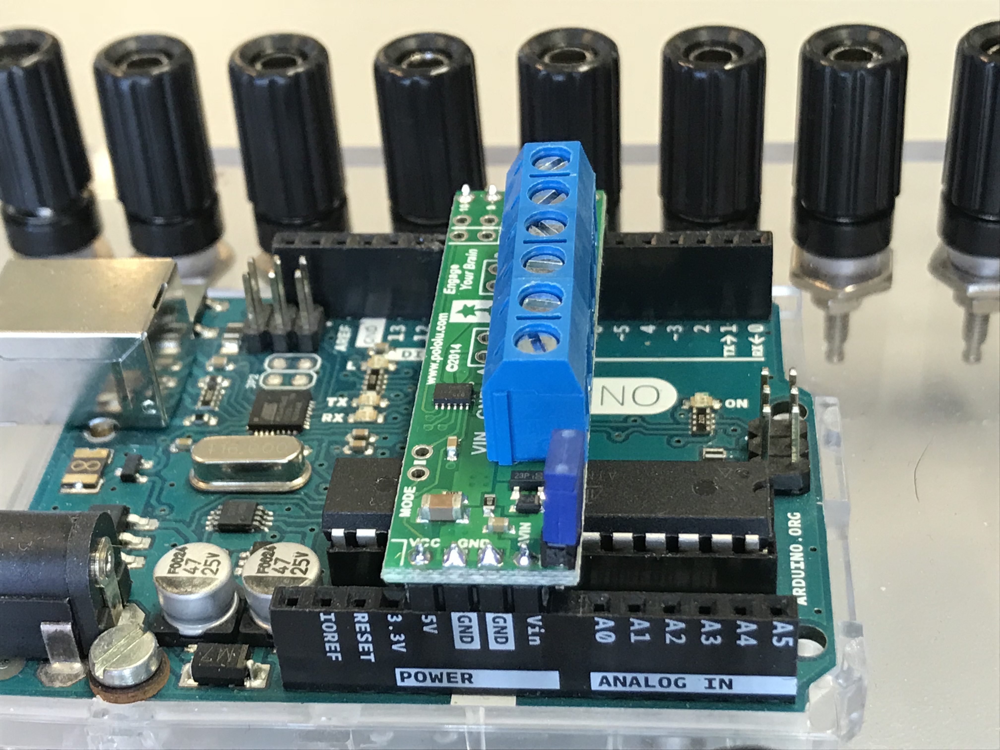

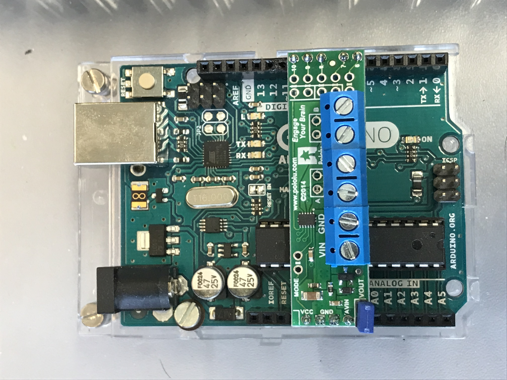

### 7. Plug the motor wires to the motor shield
- Plug the red and black wires of motor in the M1B and M1A pins of the motor shield.

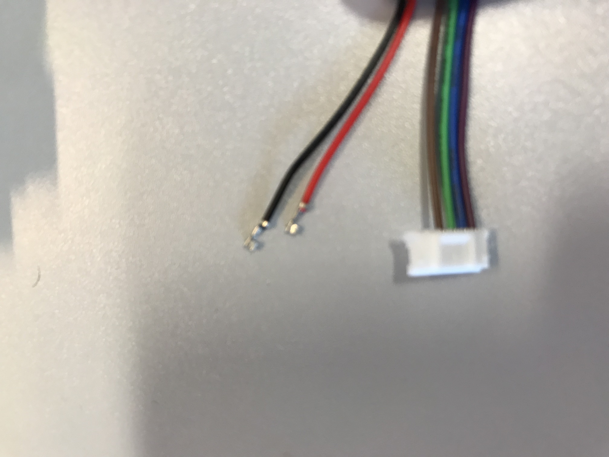

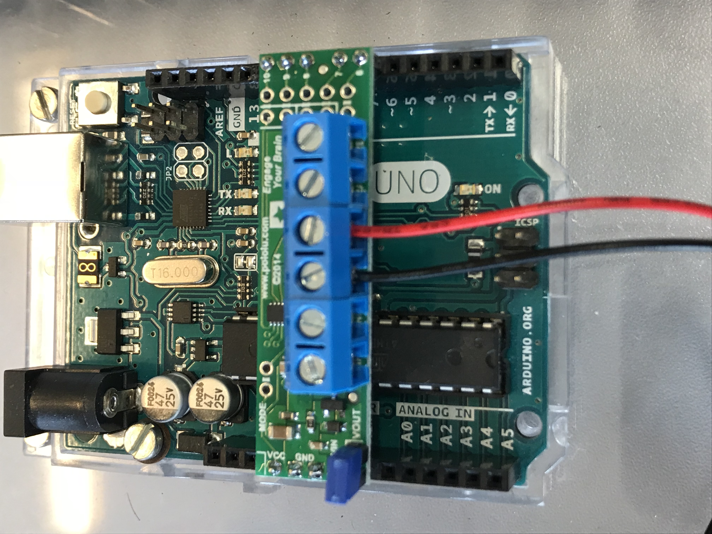

### Results
- At the end, the result look like this:

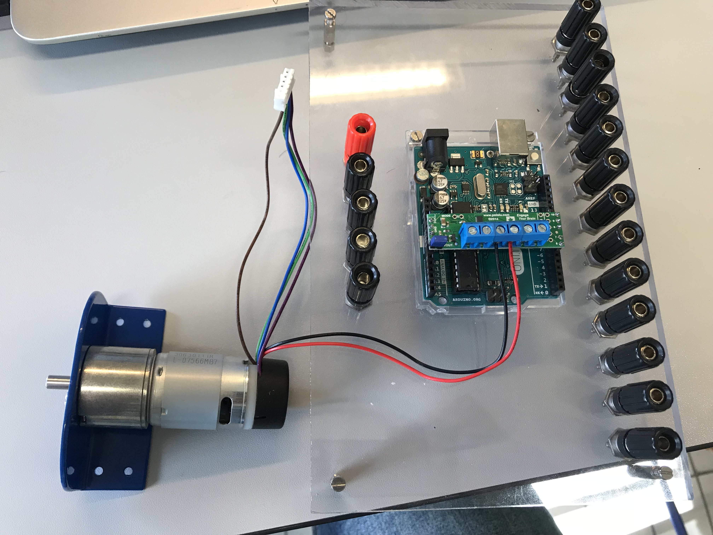