# LPro AIT 2019 - TP1 - Assembly procedure : assembly2 and compass

- Names
    - Loris ARNAUD
    - Augustin GARES

The 20th of March of 2019

## Purpose of the document

- This document is a procedure that have to be used to assemble the assembly2 (*/procedures*) and the compass.

## 1. Hardware list

- Assembly2 X1

    

- Magnetometer support X1 and M2 5mm screw X1

    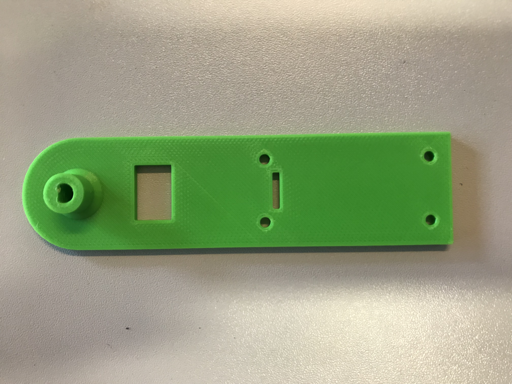

    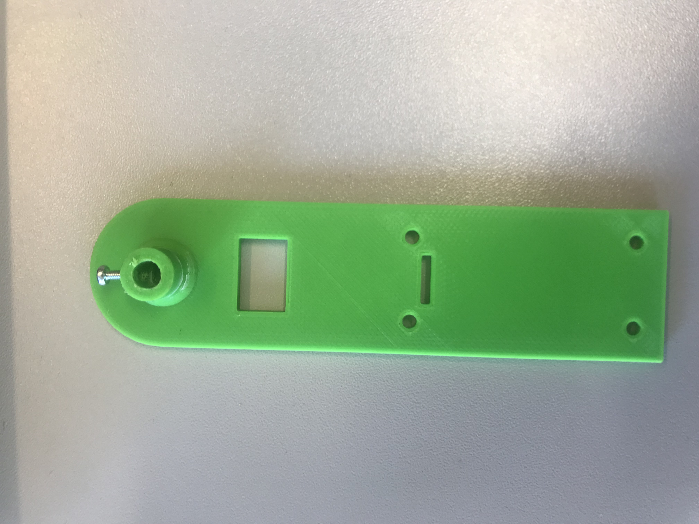

- Magnetometer HMC5883L X1

    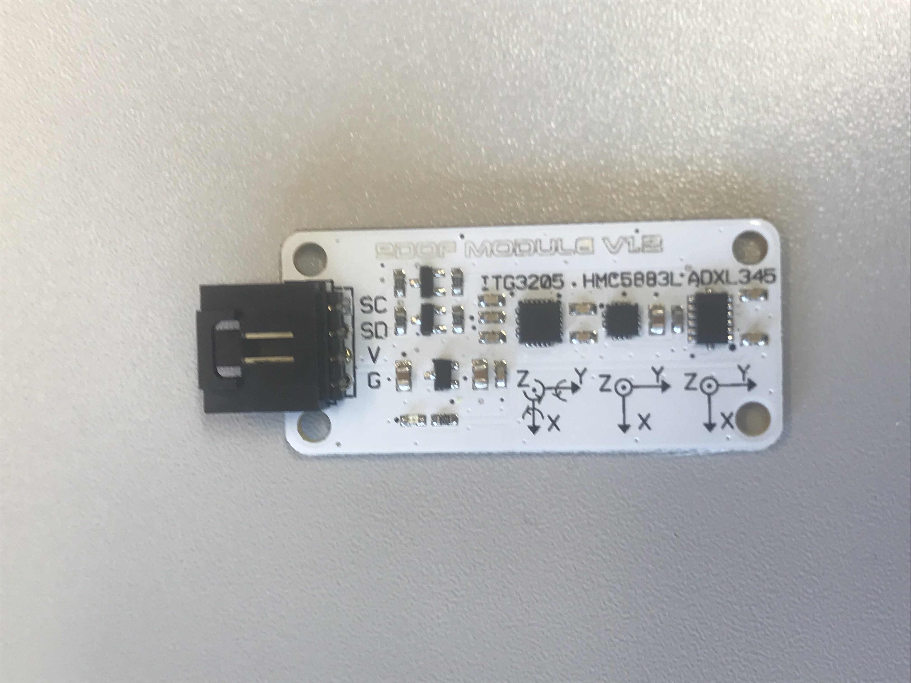

- wires X4

    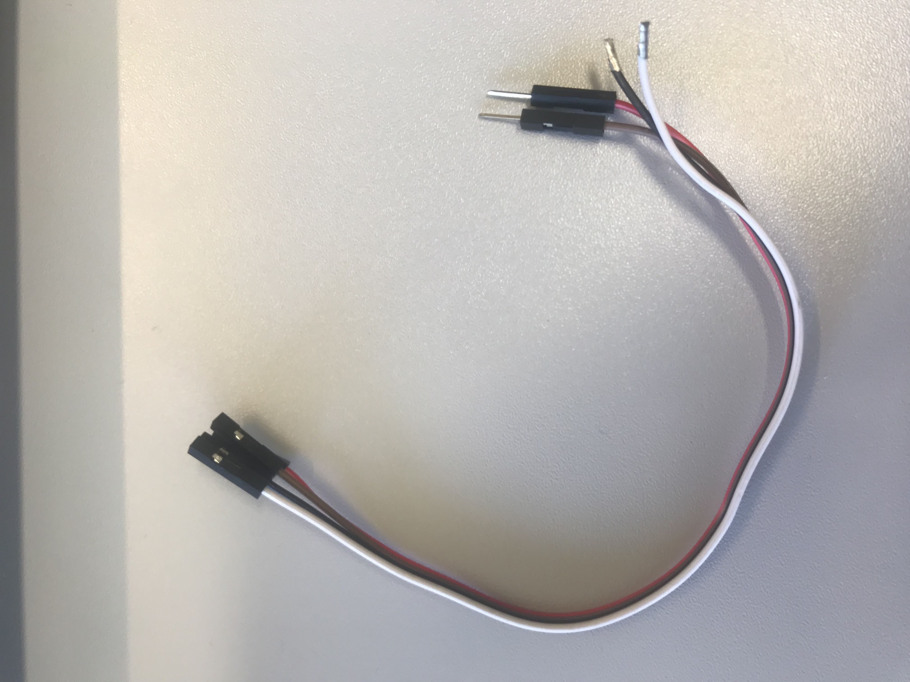

- tie wraps X4

## 2. Tools

- Flathead screwdriver X1

    

## 3. Assembly procedure : assembly2 to the compass

### 1. Mate the Magnetometer support to the motor axis
- Mate the magnetometer support to the motor axis and fix the srew until the support can't be remove.

- 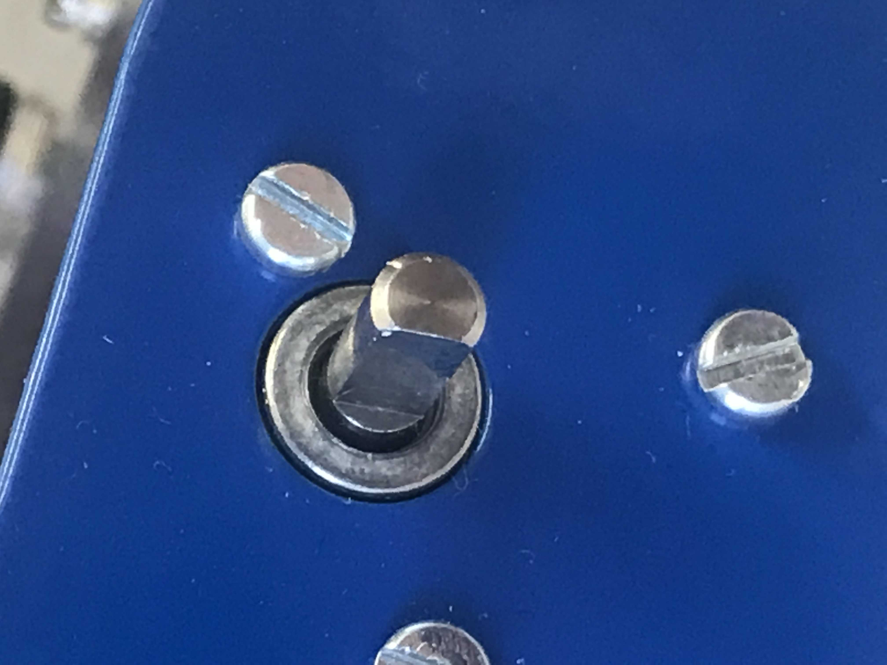

- 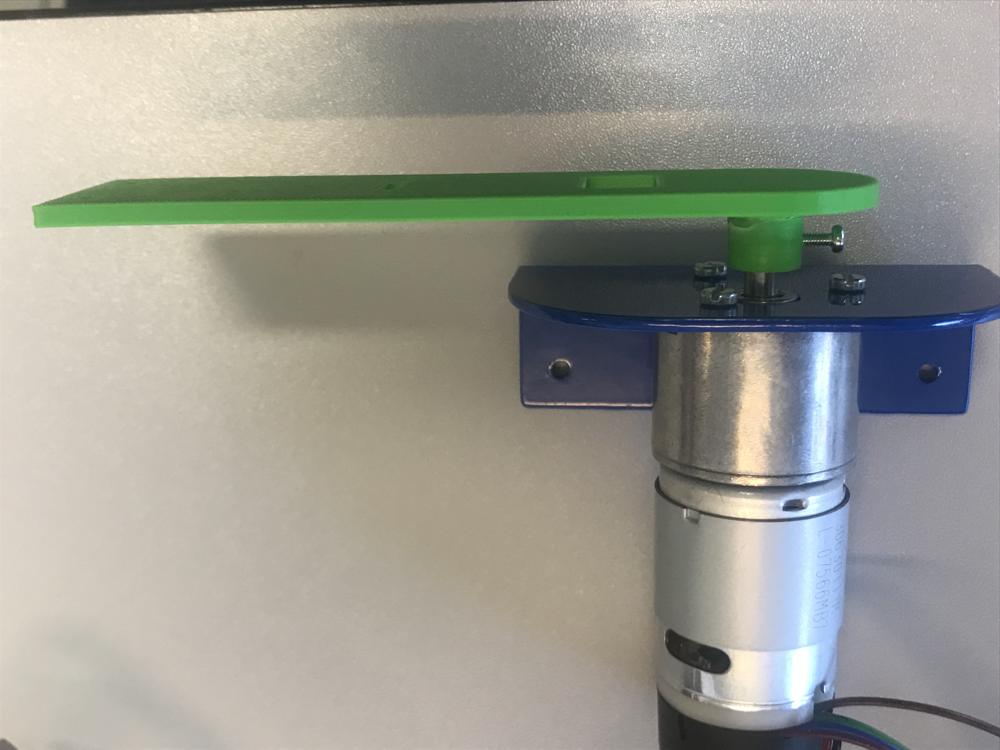

- 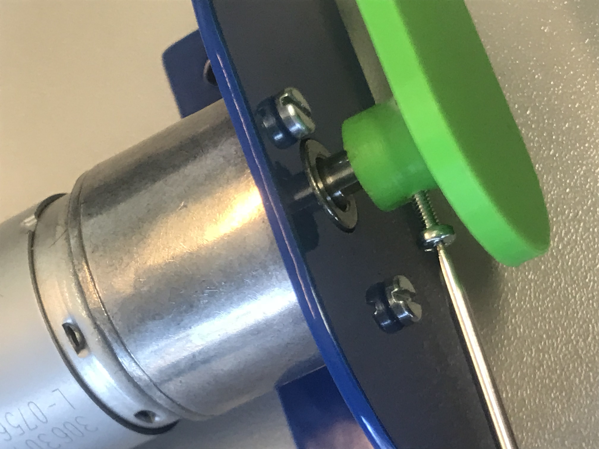

### 2. Wire the HMC5883L
- Wire the HMC5883L (octopus) like on the picture with the 4 wires.

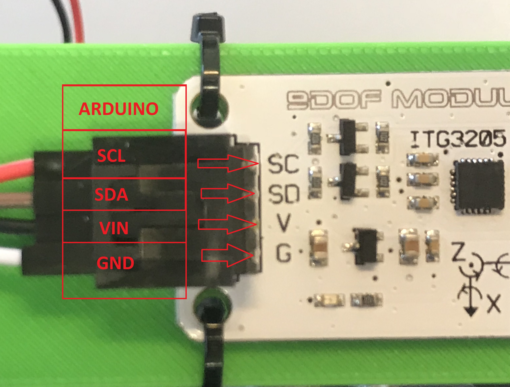

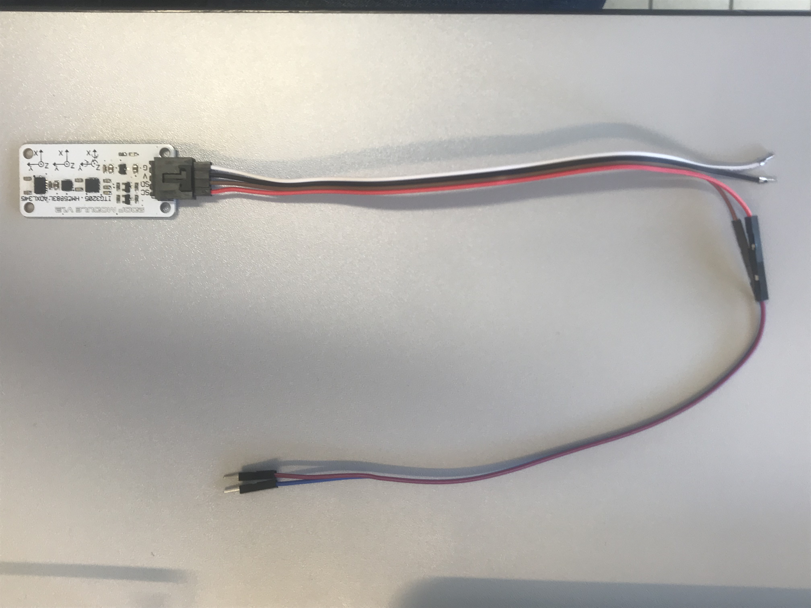

### 3. Pass the wire into the rectangle
- Pass the wires into the rectangle hole of the Magnetometer support.

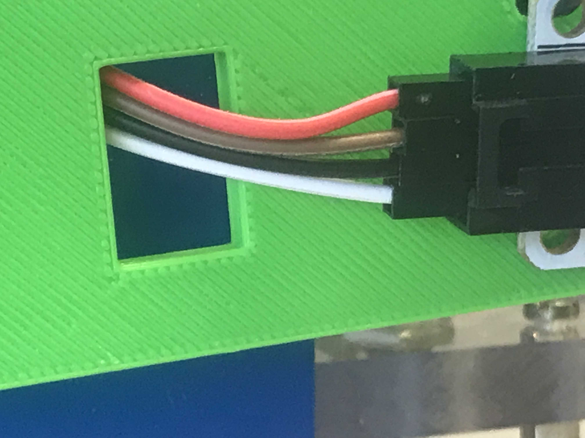

### 4. Wire the 4 wires to the Arduino
- Wire the 4 cables of the magnetometer on the arduino like on the picture.

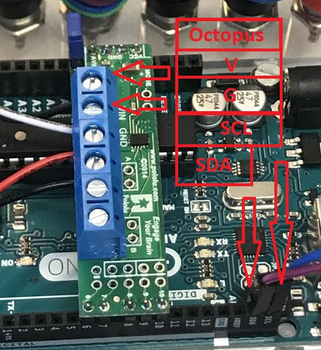

### 5. Wire the motor driver (shield)
- Srew the cables into the shield like on the picture.

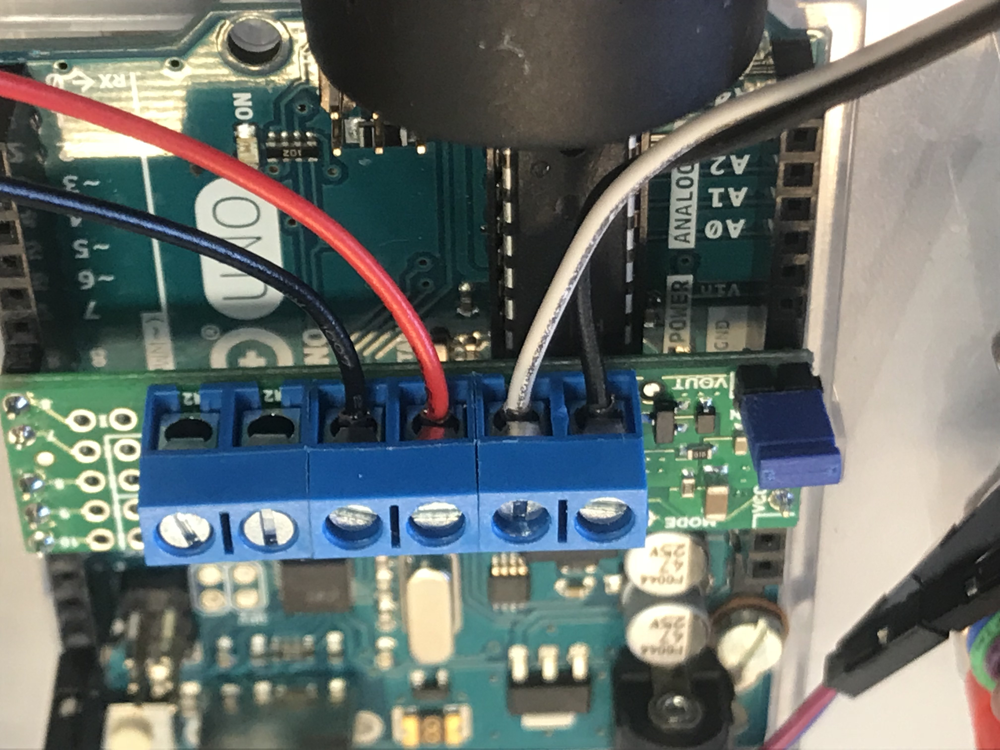

### 6. Fix the HMC5883L (octopus)
- Fix the octopus to the magnetometer support with the 4 tie wraps.

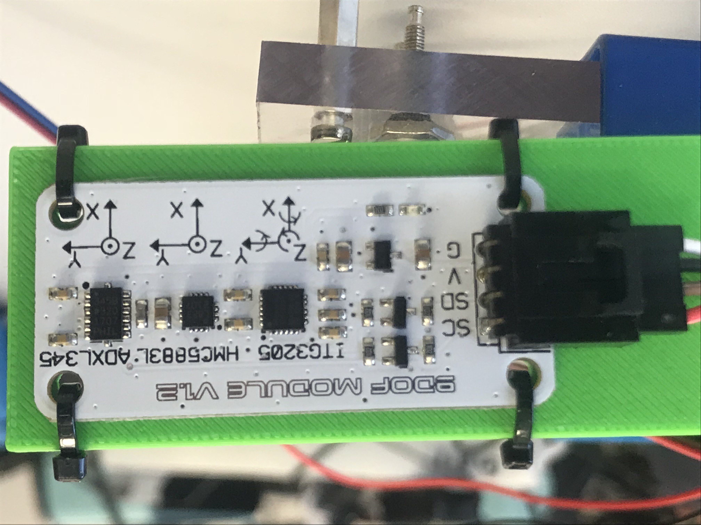

### Results
- At the end, the result look like this:

 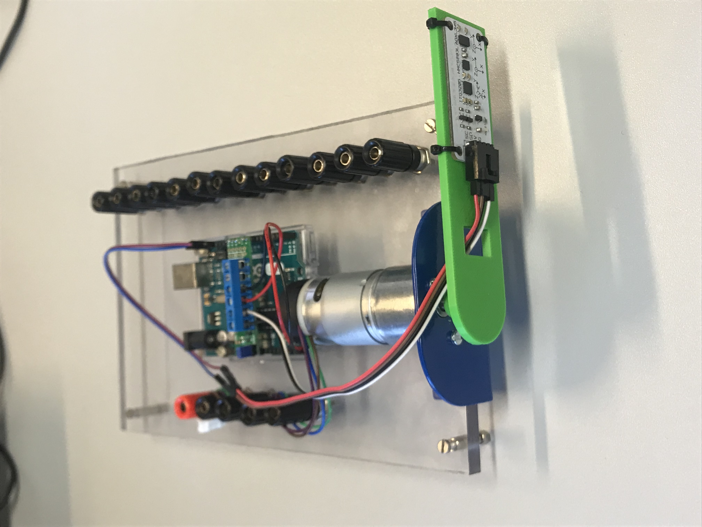